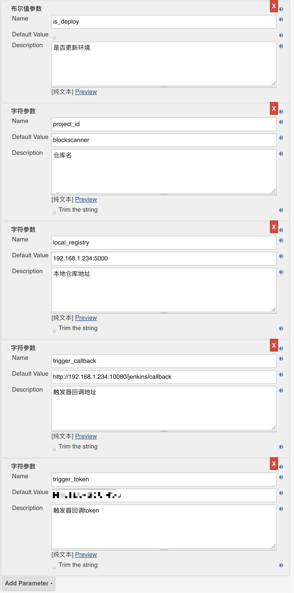

# 使用码云的Webhook完成K8S的自动构建与部署

Author: x2x4com@gmail.com

## 准备工作

- 码云账号
- Dockerfile
- Jenkins
- K8S环境
- 钉钉机器人
- 本地的镜像仓库
- 脚本运行服务器(虚机即可)
- Webhook的接收脚本
- 公网DNAT配置

## VMs
webhook脚本运行机, 192.168.1.234, ubuntu 18.04 64bit, Python3.6

镜像仓库用的是本地的仓库地址为192.168.1.234:5000


### 配置你的路由器
我这里使用的是默认的10080端口，请按照实际修改


### Dockerfile
要求项目根目录下需要存在一个Dockerfile, 用于Jenkins的构建

这里我用我项目作为例子
```
FROM artwook/python_django:latest
MAINTAINER ArtWook xx@bidpoc.com


# 新代码
COPY . /blockscanner
# RUN chown -R deploy:deploy /blockscanner
WORKDIR /blockscanner

RUN pip3 install -r requirements.txt

# USER deploy
# RUN export PATH="/app/.local/bin:${PATH}"

# EXPOSE 8000

# ENTRYPOINT
ENTRYPOINT ["./app_init.sh"]
CMD [""]
```

### 钉钉机器人

请参考钉钉文档，添加一个自定义机器人


### K8S环境
要求项目的根目录下需要存在一个k8s的目录，里面存放着项目部署使用的yaml文件，当前我的项目如下，每个单独的文件里面包含了Services, Pods以及HorizontalPodAutoscaler的设置

```
$ tree k8s/
k8s/
├── artwook-dev-app-blockscannerapitask-1.yaml
├── artwook-dev-app-blockscannerapp-1.yaml
├── artwook-dev-app-blockscannerbeat-1.yaml
├── artwook-dev-app-blockscannerchecker-1.yaml
├── artwook-dev-app-blockscannercounter-1.yaml
├── artwook-dev-app-blockscannerpreparer-1.yaml
└── artwook-dev-app-blockscannerscanner-1.yaml

0 directories, 7 files
```
yaml文件内容样例

```
apiVersion: extensions/v1beta1
kind: Deployment
metadata:
  annotations:
    kubernetes.io/change-cause: update to latest
  labels:
    env: dev
    name: blockscannerapp
    owner: artwook
    sort: '1'
    type: app
  name: artwook-dev-app-blockscannerapp-1
  namespace: default
spec:
  replicas: 1
  selector:
    matchLabels:
      env: dev
      name: blockscannerapp
      owner: artwook
      sort: '1'
      type: app
  strategy:
    rollingUpdate:
      maxSurge: 1
      maxUnavailable: 1
    type: RollingUpdate
  template:
    metadata:
      labels:
        env: dev
        name: blockscannerapp
        owner: artwook
        sort: '1'
        type: app
    spec:
      containers:
      - args:
        - start
        - app
        env:
        - name: APP_DB_NAME
          valueFrom:
            secretKeyRef:
              key: APP_DB_NAME
              name: artwook-dev-app-blockscanner-env
        - name: APP_DB_USER
          valueFrom:
            secretKeyRef:
              key: APP_DB_USER
              name: artwook-dev-app-blockscanner-env
        - name: APP_DB_PASS
          valueFrom:
            secretKeyRef:
              key: APP_DB_PASS
              name: artwook-dev-app-blockscanner-env
        - name: APP_DB_HOST
          valueFrom:
            secretKeyRef:
              key: APP_DB_HOST
              name: artwook-dev-app-blockscanner-env
        - name: APP_DB_PORT
          valueFrom:
            secretKeyRef:
              key: APP_DB_PORT
              name: artwook-dev-app-blockscanner-env
        - name: APP_CELERY_BROKER_URL
          valueFrom:
            secretKeyRef:
              key: APP_CELERY_BROKER_URL
              name: artwook-dev-app-blockscanner-env
        - name: SCANNER_NETWORK
          valueFrom:
            secretKeyRef:
              key: SCANNER_NETWORK
              name: artwook-dev-app-blockscanner-env
        - name: SCANNER_BLOCK_CURRENT
          valueFrom:
            secretKeyRef:
              key: SCANNER_BLOCK_CURRENT
              name: artwook-dev-app-blockscanner-env
        - name: SCANNER_BLOCK_CONFIRM
          valueFrom:
            secretKeyRef:
              key: SCANNER_BLOCK_CONFIRM
              name: artwook-dev-app-blockscanner-env
        - name: SCANNER_REDIS_URL
          valueFrom:
            secretKeyRef:
              key: SCANNER_REDIS_URL
              name: artwook-dev-app-blockscanner-env
        - name: SCANNER_WAITING
          valueFrom:
            secretKeyRef:
              key: SCANNER_WAITING
              name: artwook-dev-app-blockscanner-env
        - name: SCANNER_RPC_MAINNET
          valueFrom:
            secretKeyRef:
              key: SCANNER_RPC_MAINNET
              name: artwook-dev-app-blockscanner-env
        - name: SCANNER_RPC_KOVAN
          valueFrom:
            secretKeyRef:
              key: SCANNER_RPC_KOVAN
              name: artwook-dev-app-blockscanner-env
        - name: SCANNER_RPC_ROPSTEN
          valueFrom:
            secretKeyRef:
              key: SCANNER_RPC_ROPSTEN
              name: artwook-dev-app-blockscanner-env
        - name: SWEEP_GAS_PRICE_LOW
          valueFrom:
            secretKeyRef:
              key: SWEEP_GAS_PRICE_LOW
              name: artwook-dev-app-blockscanner-env
        - name: SWEEP_COLD_WALLET
          valueFrom:
            secretKeyRef:
              key: SWEEP_COLD_WALLET
              name: artwook-dev-app-blockscanner-env
        - name: SWEEP_CREATE
          valueFrom:
            secretKeyRef:
              key: SWEEP_CREATE
              name: artwook-dev-app-blockscanner-env
        - name: SWEEP_CREATE_PRIKEY
          valueFrom:
            secretKeyRef:
              key: SWEEP_CREATE_PRIKEY
              name: artwook-dev-app-blockscanner-env
        - name: SWEEP_CONTRACT_CONTROLLER
          valueFrom:
            secretKeyRef:
              key: SWEEP_CONTRACT_CONTROLLER
              name: artwook-dev-app-blockscanner-env
        - name: SWEEP_CONTRACT_AUTHORITY
          valueFrom:
            secretKeyRef:
              key: SWEEP_CONTRACT_AUTHORITY
              name: artwook-dev-app-blockscanner-env
        - name: ETH_LIMIT
          valueFrom:
            secretKeyRef:
              key: ETH_LIMIT
              name: artwook-dev-app-blockscanner-env
        - name: ERC20_TOKEN_AKC_ADDRESS
          valueFrom:
            secretKeyRef:
              key: ERC20_TOKEN_AKC_ADDRESS
              name: artwook-dev-app-blockscanner-env
        - name: ERC20_TOKEN_AKC_LIMIT
          valueFrom:
            secretKeyRef:
              key: ERC20_TOKEN_AKC_LIMIT
              name: artwook-dev-app-blockscanner-env
        - name: API_GATEWAY_HOST
          valueFrom:
            secretKeyRef:
              key: API_GATEWAY_HOST
              name: artwook-dev-app-blockscanner-env
        - name: API_GATEWAY_PUBKEY
          valueFrom:
            secretKeyRef:
              key: API_GATEWAY_PUBKEY
              name: artwook-dev-app-blockscanner-env
        - name: API_GATEWAY_APP_PRIVKEY
          valueFrom:
            secretKeyRef:
              key: API_GATEWAY_APP_PRIVKEY
              name: artwook-dev-app-blockscanner-env
        - name: API_GATEWAY_APP_ACCESSKEYID
          valueFrom:
            secretKeyRef:
              key: API_GATEWAY_APP_ACCESSKEYID
              name: artwook-dev-app-blockscanner-env
        - name: API_GATEWAY_APP_SECRETKEY
          valueFrom:
            secretKeyRef:
              key: API_GATEWAY_APP_SECRETKEY
              name: artwook-dev-app-blockscanner-env
        - name: API_GATEWAY_TIMEOUT
          valueFrom:
            secretKeyRef:
              key: API_GATEWAY_TIMEOUT
              name: artwook-dev-app-blockscanner-env
        - name: SCANNER_ADDRESS_FREE
          value: "500"
        image: 192.168.1.234:5000/blockscanner:42bd09668460c1c40290f1f0cb61dc1a21d4aed0
        name: artwook-dev-app-blockscannerapp-1
        ports:
          - containerPort: 8000
            protocol: TCP
        resources:
          limits:
            cpu: '1'
          requests:
            cpu: 100m
      securityContext:
        fsGroup: 1000
---
apiVersion: v1
kind: Service
metadata:
  labels:
    env: dev
    name: blockscannerapp
    owner: artwook
    sort: '1'
    type: app
  name: artwook-dev-app-blockscannerapp-1
  namespace: default
spec:
  externalTrafficPolicy: Cluster
  ports:
  - port: 8000
    protocol: TCP
    targetPort: 8000
  selector:
    env: dev
    name: blockscannerapp
    owner: artwook
    sort: '1'
    type: app
  sessionAffinity: None
  type: NodePort
---
apiVersion: autoscaling/v2beta1
kind: HorizontalPodAutoscaler
metadata:
  name: artwook-dev-app-blockscannerapp-1
  namespace: default
spec:
  maxReplicas: 1
  metrics:
  - resource:
      name: cpu
      targetAverageUtilization: 80
    type: Resource
  minReplicas: 1
  scaleTargetRef:
    apiVersion: apps/v1beta1
    kind: Deployment
    name: artwook-dev-app-blockscannerapp-1

```


K8S环境部署这里不说了，请自行查看文档后部署

我的测试环境如下
```
NAME           STATUS    ROLES     AGE       VERSION   EXTERNAL-IP   OS-IMAGE             KERNEL-VERSION     CONTAINER-RUNTIME
kub-master-1   Ready     master    312d      v1.9.3    <none>        Ubuntu 16.04.3 LTS   4.4.0-87-generic   docker://17.12.1-ce
kub-node-1     Ready     <none>    312d      v1.9.3    <none>        Ubuntu 16.04.3 LTS   4.4.0-87-generic   docker://17.12.1-ce
kub-node-2     Ready     <none>    312d      v1.9.3    <none>        Ubuntu 16.04.3 LTS   4.4.0-87-generic   docker://17.12.1-ce
kub-node-3     Ready     <none>    312d      v1.9.3    <none>        Ubuntu 16.04.3 LTS   4.4.0-87-generic   docker://17.12.1-ce
```

我们这里简单粗暴点，登陆kub-master-1，将集群管理的配置文件复制到脚本运行机

```
sudo scp /etc/kubernetes/admin.conf runner@192.168.1.234:/home/runner
```


### Jenkins环境

需要用到的插件

- Generic Webhook Trigger
- 钉钉通知器
- docker插件

登陆Jenkins，创建项目，下面以blockscanner为例

1. 构建一个自由风格的软件项目

2. 勾选参数化构建过程

    添加下面的参数
    - 布尔值参数 is_deploy
    - 字符串参数 project_id 默认值 blockscanner
    - 字符串参数 local_registry 默认值 192.168.1.234:5000
    - 字符串参数 trigger_callback 默认值 http://192.168.1.234:10080/jenkins/callback
    - 字符串参数 trigger_token 默认值 abcdefg(自行更改)
    

3. 源码管理选择Git， Repository URL: 你项目的地址，然后选择部署公钥Credentials下拉选择，分支写*/dev(请按照你想要的分支改动)

    

4.  在Build Triggers处勾选Trigger builds remotely， 并在下面的Token处填入密码，这里我们假设是11111111
    

4. 编译镜像，在Build处添加构建步骤，选择执行Shell

    在内容出填入
    ```
    echo "Start to build ${project_id} docker image with $GIT_COMMIT @ $GIT_BRANCH"
    docker build . -t ${project_id}:${GIT_COMMIT}
    echo "Tag ${project_id}:${GIT_COMMIT} to local_registry: ${local_registry} "
    docker tag ${project_id}:${GIT_COMMIT} ${local_registry}/${project_id}:${GIT_COMMIT}
    docker push ${local_registry}/${project_id}:${GIT_COMMIT}
    echo "build done"
    ```

5. 回调通知，在Build处添加构建步骤，选择执行Shell

    在内容出填入
    ```
    echo "callback ${trigger_callback}, ${GIT_COMMIT} build finish"
    curl --silent "${trigger_callback}?commit_hash=${GIT_COMMIT}&token=${trigger_token}&is_deploy=${is_deploy}&job_name=${JOB_NAME}&build_tag=${BUILD_TAG}&project_id=${project_id}"
    echo "callback done"
    ```

6. 替换yaml文件中的变量，在Build处添加构建步骤，选择执行Shell

    在内容出填入
    ```
    #!/usr/bin/python3
    # encoding: utf-8

    from os import environ
    from sys import exit
    import yaml
    import glob
    from os.path import basename
    import json
    import urllib.request as urllib

    deploy_callback_url = "http://192.168.1.234:10080/deploy/callback"
    local_registry = environ.get('local_registry')
    trigger_token = environ.get('trigger_token')
    is_deploy = environ.get('is_deploy')
    build_tag = environ.get('BUILD_TAG')
    project_id = environ.get('project_id')
    git_commit = environ.get('GIT_COMMIT')
    image_url = local_registry + '/' + str(project_id) + ":" + str(git_commit)

    target_list = []


    def call_remote_deploy(data:list=list()):
        status_struct = {
            "is_deploy": is_deploy,
            "token": trigger_token,
            "project_id": project_id,
            "commit_hash": git_commit,
            "build_tag": build_tag,
            "status_details": data
        }
        print("send data to hook")
        url = urllib.Request(deploy_callback_url)
        url.add_header('Content-Type', 'application/json')
        data = json.dumps(status_struct).encode()
        try:
            resp = urllib.urlopen(url, data, timeout=30)
            status_code = resp.getcode()
            text = resp.read().decode('utf-8')
            print("hook code: %s" % status_code)
            print("hook return: %s" % text)
        except urllib.HTTPError as e:
            text = e.fp.read().decode('utf-8')
            print("callback error: %s" % text)


    if is_deploy != "true":
        print('Just build, no deploy')
        exit(0)

    deployments = glob.glob('./k8s/*.yaml')
    for deploy in deployments:
        container_id = None
        filename = basename(deploy)
        _filename_a = filename.split('.')
        _yaml_index = _filename_a.index('yaml')
        deploy_id = ".".join(_filename_a[0:_yaml_index])
        print("deploy_id: %s" % deploy_id)
        # target_yaml = "/tmp/" + filename
        target_config = {}
        with open(deploy, 'r') as raw:
            try:
                _config = yaml.load_all(raw.read())
            except yaml.YAMLError as e:
                # callback_hook(status=False, message=str(e))
                print(e)
                continue
        for tc in _config:
            target_config[tc['kind']] = tc
        print(target_config.keys())
        try:
            containers = target_config['Deployment']['spec']['template']['spec']['containers']
        except Exception as e:
            continue
        for i, cc in enumerate(containers):
            if cc['name'] == deploy_id:
                container_id = i
        if container_id is not None:
            target_config['Deployment']['spec']['template']['spec']['containers'][container_id]['image'] = image_url
            try:
                target_config['Deployment']['metadata']['annotations']['kubernetes.io/change-cause'] = 'update to %s' % git_commit
            except KeyError:
                pass
            pre_out = [None] * len(target_config.keys())
            pre_out[0] = target_config["Deployment"]
            if "Service" in target_config.keys():
                pre_out[1] = target_config["Service"]
                if "HorizontalPodAutoscaler" in target_config.keys():
                    pre_out[2] = target_config["HorizontalPodAutoscaler"]
            elif "HorizontalPodAutoscaler" in target_config.keys():
                pre_out[1] = target_config["HorizontalPodAutoscaler"]
            print(len(pre_out))
            target_list.append({deploy_id:pre_out})
        else:
            print(deploy_id)
            continue

    call_remote_deploy(data=target_list)
    ```

7. 添加钉钉回调(可选)，在Post-build Actions处添加post-build action

   下拉选择钉钉通知配置，填入钉钉机器人的access token

8. 测试是否能够构建

    

    点击Build with Parameters， 右边勾上is_deploy，然后点击Build测试一下

9. 创建用户的api秘钥

    点击用户的配置，在API token处新建一个token，记录下来


### 脚本运行机

登陆脚本机， ssh runner@192.168.1.234

1. 安装kubectl
    ```
    sudo apt-get update && sudo apt-get install -y apt-transport-https
    curl -s https://packages.cloud.google.com/apt/doc/apt-key.gpg | sudo apt-key add -
    echo "deb https://apt.kubernetes.io/ kubernetes-xenial main" | sudo tee -a /etc/apt/sources.list.d/kubernetes.list
    sudo apt-get update
    sudo apt-get install -y kubectl
    ```

2. 复制授权文件
    ```
    cd $HOME
    [ ! -d ".kube" ] && mkdir .kube
    [ ! -f "./kube/config" ] && mv ./kube/config ./kube/config.`date +%s`.bk
    mv admin.conf .kube/config
    ```

3. 确认kubectl安装成功
    ```
    $ kubectl version
    Client Version: version.Info{Major:"1", Minor:"13", GitVersion:"v1.13.1", GitCommit:"eec55b9ba98609a46fee712359c7b5b365bdd920", GitTreeState:"clean", BuildDate:"2018-12-13T10:39:04Z",     GoVersion:"go1.11.2", Compiler:"gc", Platform:"linux/amd64"}
    Server Version: version.Info{Major:"1", Minor:"9", GitVersion:"v1.9.3", GitCommit:"d2835416544f298c919e2ead3be3d0864b52323b", GitTreeState:"clean", BuildDate:"2018-02-07T11:55:20Z",     GoVersion:"go1.9.2", Compiler:"gc", Platform:"linux/amd64"}
    ```

    ```
    $ kubectl get node
    NAME           STATUS   ROLES    AGE    VERSION
    kub-master-1   Ready    master   312d   v1.9.3
    kub-node-1     Ready    <none>   312d   v1.9.3
    kub-node-2     Ready    <none>   312d   v1.9.3
    kub-node-3     Ready    <none>   312d   v1.9.3
    ```

4. 创建venv环境
    ```
    cd $HOME
    python3 -m venv webhook
    ```

5. 下载webhook接收脚本
    ```
    cd webhook
    git clone https://gitee.com/x2x4/gitee_trigger.git src
    ```

6. 激活venv环境
    ```
    . bin/activate
    ```

7. 安装依赖文件
    ```
    cd src
    pip install -r requirements.txt
    ```

8. 修改配置文件

    修改或者创建配置文件
    ```
    cp cfg.py.example cfg.py
    ```

    例子
    ```
    #!/usr/bin/env python
    # encoding: utf-8
    token_list = [
        'incoming_token',
        'incoming_token2'
    ]

    global_password = [
        'global_password'
    ]

    jenkins = {
        'user': 'your jenkins user',
        'secret': 'some_jenkins_token',
        'host': 'http://192.168.1.234:18080',
        'repos': {
            # my gitee repo is https://gitee.com/artwook/app_blockscanner
            "artwook": {
                "app_blockscanner": {
                    "branch": ["dev"],
                    'jenkins_url': '/job/blockscanner',
                    'jenkins_token': '11111111'
                },
            },
        }
    }

    dd_9chain_tech_robot='https://oapi.dingtalk.com/robot/send?access_token=dingding_access_token'

    # key 码云的用户username
    # val 对应的dingding手机号码
    git_user = {
        'x2x4': 18000000000,

    }

    DEBUG = False
    gitee_token = "gitee_token"

    ```

    gitee_token 在码云配置中设定

9. 启动测试

   ```
   $ python3 UpdateDev.py
   2019-01-16 16:32:20,837 [INFO] _internal.py[line:87]  * Running on http://0.0.0.0:10080/ (Press CTRL+C to quit)
   2019-01-16 16:32:27,769 [INFO] _internal.py[line:87] 127.0.0.1 - - [16/Jan/2019 16:32:27] "GET / HTTP/1.1" 200 -
   ```
   启动没有问题

## 码云配置

1. 在码云上创建一个机器人账号，给项目相应的提交Issue的权限，并添加一个私人令牌，将令牌保存到cfg.py中的gitee_token处
2. 在企业后台添加一个全局的Webhook
   POST -> http://your_ip:10080/oschina/update.json?token=incoming_token PASSWORD -> global_password

## 开始使用

项目切换到dev分支
```
$ git status
On branch dev
Your branch is up to date with 'origin/dev'.

nothing to commit, working tree clean
```

随便修改一个文件
```
echo " " >> README.md
```

使用触发commit来触发构建

触发commit有2种类型，都需要使用 #CMD:开始

- #CMD:build   只是构建项目，不部署
- #CMD:deploy  构建并部署项目

```
git add . && git commit -m "test deploy, #CMD:deploy" && git push
```

这个时候触发器的日志显示

```
2019-01-16 08:44:16,997 [INFO] UpdateDev.py[line:346] artwook/app_blockscanner pushed
2019-01-16 08:44:16,997 [INFO] UpdateDev.py[line:360] target artwook/app_blockscanner ,branch dev
2019-01-16 08:44:16,998 [INFO] UpdateDev.py[line:369] Commit Message: test deploy, #CMD:deploy
2019-01-16 08:44:16,998 [INFO] UpdateDev.py[line:371] Search for at
2019-01-16 08:44:16,998 [INFO] UpdateDev.py[line:381] at users: []
2019-01-16 08:44:16,999 [INFO] UpdateDev.py[line:385] Search for cmd
2019-01-16 08:44:16,999 [INFO] UpdateDev.py[line:396] isBuild: True
2019-01-16 08:44:17,000 [INFO] UpdateDev.py[line:397] isDeploy: True
2019-01-16 08:44:17,000 [INFO] UpdateDev.py[line:416] msg: 收到了构建请求!!
x2x4在分支dev上提交了代码0b656447ae91e98a21b47474bf1c091b2628ca4b
提交信息: test deploy, #CMD:deploy
开始向Jenkins提交构建请求

2019-01-16 08:44:17,243 [INFO] Dingding.py[line:106] {"errmsg":"ok","errcode":0}
2019-01-16 08:44:17,245 [INFO] Dingding.py[line:108] {'msgtype': 'text', 'text': {'content': '收到了构建请求!!\nx2x4在分支dev上提交了代码0b656447ae91e98a21b47474bf1c091b2628ca4b\n提交信息: test deploy, #CMD:deploy\n开始向Jenkins提交构建请求\n'}, 'at': {'atMobiles': [], 'isAtAll': False}} 发送成功
2019-01-16 08:44:17,245 [INFO] UpdateDev.py[line:431] http://192.168.1.234:18080/job/blockscanner/buildWithParameters?token=11111111&is_deploy=true&cause=0b656447ae91e98a21b47474bf1c091b2628ca4b+build_deploy
2019-01-16 08:44:17,261 [INFO] UpdateDev.py[line:433] 201
2019-01-16 08:44:17,261 [INFO] UpdateDev.py[line:436] location: http://192.168.1.234:18080/queue/item/609/
2019-01-16 08:44:17,262 [INFO] UpdateDev.py[line:437] get task info
2019-01-16 08:44:17,273 [ERROR] UpdateDev.py[line:443] {"_class":"hudson.model.Queue$WaitingItem","actions":[{"_class":"hudson.model.ParametersAction","parameters":[{"_class":"hudson.model.BooleanParameterValue","name":"is_deploy","value":true},{"_class":"hudson.model.StringParameterValue","name":"project_id","value":"blockscanner"},{"_class":"hudson.model.StringParameterValue","name":"local_registry","value":"192.168.1.234:5000"},{"_class":"hudson.model.StringParameterValue","name":"trigger_callback","value":"http://192.168.1.234:10080/jenkins/callback"},{"_class":"hudson.model.StringParameterValue","name":"trigger_token","value":"HNhJB3JawJ52JqrxKotu"}]},{"_class":"hudson.model.CauseAction","causes":[{"_class":"hudson.model.Cause$RemoteCause","shortDescription":"Started by remote host 10.255.0.2 with note: 0b656447ae91e98a21b47474bf1c091b2628ca4b build_deploy","addr":"10.255.0.2","note":"0b656447ae91e98a21b47474bf1c091b2628ca4b build_deploy"}]}],"blocked":false,"buildable":false,"id":609,"inQueueSince":1547628257257,"params":"\nis_deploy=true\nproject_id=blockscanner\nlocal_registry=192.168.1.234:5000\ntrigger_callback=http://192.168.1.234:10080/jenkins/callback\ntrigger_token=abcdefg","stuck":false,"task":{"_class":"hudson.model.FreeStyleProject","name":"blockscanner","url":"http://192.168.1.234:18080/job/blockscanner/","color":"blue"},"url":"queue/item/609/","why":"In the quiet period. Expires in 4.9 sec","timestamp":1547628262257}
```

钉钉上显示


过了一会儿日志刷新
```
2019-01-16 08:44:42,769 [INFO] UpdateDev.py[line:199] blockscanner:0b656447ae91e98a21b47474bf1c091b2628ca4b 已经构建完成, 构建TAG: jenkins-blockscanner-136
镜像地址: 192.168.1.234:5000/blockscanner:0b656447ae91e98a21b47474bf1c091b2628ca4b
2019-01-16 08:44:42,987 [INFO] Dingding.py[line:106] {"errmsg":"ok","errcode":0}
2019-01-16 08:44:42,988 [INFO] Dingding.py[line:108] {'msgtype': 'text', 'text': {'content': 'blockscanner:0b656447ae91e98a21b47474bf1c091b2628ca4b 已经构建完成, 构建TAG: jenkins-blockscanner-136\n镜像地址: 192.168.1.234:5000/blockscanner:0b656447ae91e98a21b47474bf1c091b2628ca4b\n开始部署测试环境'}, 'at': {'atMobiles': [], 'isAtAll': False}} 发送成功
2019-01-16 08:44:44,028 [INFO] UpdateDev.py[line:250] dict_keys(['artwook-dev-app-blockscannercounter-1'])
2019-01-16 08:44:44,598 [INFO] UpdateDev.py[line:250] dict_keys(['artwook-dev-app-blockscannerapp-1'])
2019-01-16 08:44:45,178 [INFO] UpdateDev.py[line:250] dict_keys(['artwook-dev-app-blockscannerchecker-1'])
2019-01-16 08:44:45,748 [INFO] UpdateDev.py[line:250] dict_keys(['artwook-dev-app-blockscannerapitask-1'])
2019-01-16 08:44:46,335 [INFO] UpdateDev.py[line:250] dict_keys(['artwook-dev-app-blockscannerbeat-1'])
2019-01-16 08:44:46,907 [INFO] UpdateDev.py[line:250] dict_keys(['artwook-dev-app-blockscannerpreparer-1'])
2019-01-16 08:44:47,579 [INFO] UpdateDev.py[line:250] dict_keys(['artwook-dev-app-blockscannerscanner-1'])
2019-01-16 08:44:48,365 [INFO] Dingding.py[line:106] {"errmsg":"ok","errcode":0}
2019-01-16 08:44:48,367 [INFO] Dingding.py[line:108] {'msgtype': 'actionCard', 'actionCard': {'title': '0b656447ae91e98a21b47474bf1c091b2628ca4b 部署成功', 'text': '## 命令执行情况\n### artwook-dev-app-blockscannercounter-1 \n- CMD: kubectl -f /tmp/artwook-dev-app-blockscannercounter-1.yaml \n- RETURN: 0 \n### artwook-dev-app-blockscannerapp-1 \n- CMD: kubectl -f /tmp/artwook-dev-app-blockscannerapp-1.yaml \n- RETURN: 0 \n### artwook-dev-app-blockscannerchecker-1 \n- CMD: kubectl -f /tmp/artwook-dev-app-blockscannerchecker-1.yaml \n- RETURN: 0 \n### artwook-dev-app-blockscannerapitask-1 \n- CMD: kubectl -f /tmp/artwook-dev-app-blockscannerapitask-1.yaml \n- RETURN: 0 \n### artwook-dev-app-blockscannerbeat-1 \n- CMD: kubectl -f /tmp/artwook-dev-app-blockscannerbeat-1.yaml \n- RETURN: 0 \n### artwook-dev-app-blockscannerpreparer-1 \n- CMD: kubectl -f /tmp/artwook-dev-app-blockscannerpreparer-1.yaml \n- RETURN: 0 \n### artwook-dev-app-blockscannerscanner-1 \n- CMD: kubectl -f /tmp/artwook-dev-app-blockscannerscanner-1.yaml \n- RETURN: 0 \n', 'singleTitle': '点击查看详情', 'singleURL': 'http://192.168.1.234:10080/deploy/details/blockscanner/0b656447ae91e98a21b47474bf1c091b2628ca4b', 'btnOrientation': '0', 'hideAvatar': '0'}} 发送成功
```

钉钉再次提醒


检查一下githash，项目目录下

```
$ git log -1
commit 0b656447ae91e98a21b47474bf1c091b2628ca4b (HEAD -> dev, origin/dev)
Author: 许向 <x2x4com@gmail.com>
Date:   Wed Jan 16 16:44:14 2019 +0800

    test deploy, #CMD:deploy
```

git hash是0b656447ae91e98a21b47474bf1c091b2628ca4b

检查一下更新的pod

```
$ kubectl get pods
NAME                                                      READY     STATUS    RESTARTS   AGE
artwook-dev-app-blockscannerapitask-1-5d8c94c8d6-tzk74    1/1       Running   0          12m
artwook-dev-app-blockscannerapp-1-84df7cf4f9-ghhhn        1/1       Running   0          12m
artwook-dev-app-blockscannerbeat-1-76696f4dc7-5xspd       1/1       Running   0          12m
artwook-dev-app-blockscannerchecker-1-d646f9667-ll5dd     1/1       Running   0          12m
artwook-dev-app-blockscannercounter-1-5c96f5fc98-5rzv9    1/1       Running   0          12m
artwook-dev-app-blockscannerpreparer-1-5c9f5d7bb8-nlwxs   1/1       Running   0          12m
artwook-dev-app-blockscannerscanner-1-d957fdbc8-cmf4r     1/1       Running   0          12m
artwook-dev-app-gateway-1-7679b7777d-k27bx                1/1       Running   0          2m
artwook-dev-app-mainsidekiq-1-7f66cf846-5d4h2             1/1       Running   0          2h
artwook-dev-app-maintyche-1-579bb4c9b6-6cqn7              1/1       Running   0          2h
artwook-dev-app-vbank-1-6fb7495dc6-mjwjv                  1/1       Running   0          7d
artwook-dev-app-walletweb-1-586b79c8dc-5btlz              1/1       Running   0          6d
artwook-dev-service-blockscannerredis-1-b56dd8d84-m8f8n   1/1       Running   1          51d
artwook-dev-service-redis-1-6b6f4469fc-98zmd              1/1       Running   1          51d
```

选择artwook-dev-app-blockscannerapp-1-84df7cf4f9-ghhhn来检查一下

```
$ kubectl describe pods/artwook-dev-app-blockscannerapp-1-84df7cf4f9-ghhhn
Name:           artwook-dev-app-blockscannerapp-1-84df7cf4f9-ghhhn
Namespace:      default
Node:           kub-node-3/192.168.1.233
Start Time:     Wed, 16 Jan 2019 16:44:45 +0800
Labels:         env=dev
                name=blockscannerapp
                owner=artwook
                pod-template-hash=4089379095
                sort=1
                type=app
Annotations:    <none>
Status:         Running
IP:             10.244.3.15
Controlled By:  ReplicaSet/artwook-dev-app-blockscannerapp-1-84df7cf4f9
Containers:
  artwook-dev-app-blockscannerapp-1:
    Container ID:  docker://5c7ecc871db4a83af78975721dadacc1ea43b605af67aec988ed3b1d006a95bb
    Image:         192.168.1.234:5000/blockscanner:0b656447ae91e98a21b47474bf1c091b2628ca4b
    Image ID:      docker-pullable://192.168.1.234:5000/blockscanner@sha256:c5ebaab6309b2bfdfaf7d77667333d9e7c26cd1a0b47f776b4b2eca04bb4de29
    Port:          8000/TCP
    Host Port:     0/TCP
    Args:
...
```

看到pod的镜像已经更新成了0b656447ae91e98a21b47474bf1c091b2628ca4b，更新已经成功了


P.S. 此文档为后补，可能再某些环节会有遗漏，如果碰到问题，请给我提Issues
